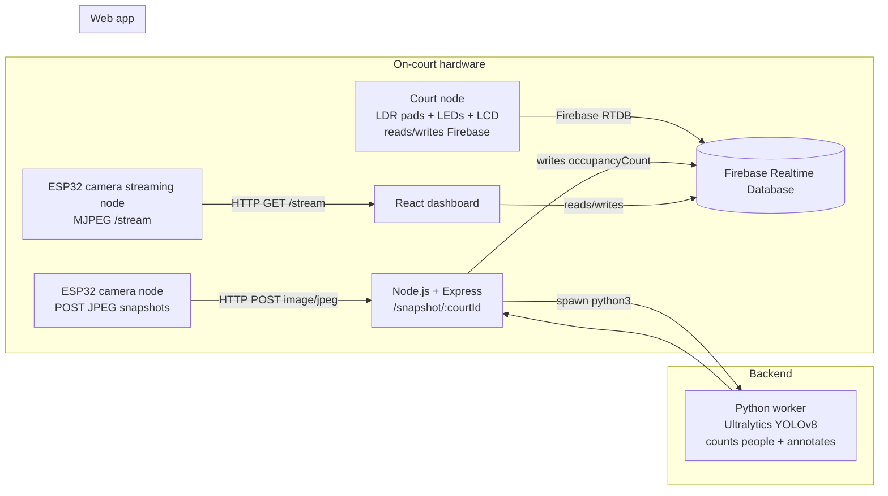

## PicklePortal

PicklePortal is a small IoT + web dashboard project for monitoring pickleball court occupancy and queue length in near real time using ESP32 devices, a lightweight Node.js server, and Firebase Realtime Database.

It’s built for recreational facilities (or a single set of courts) that want a simple “is the court free / is there a queue?” view plus a live camera feed.


---

## Key Features

- Web dashboard showing per-court occupancy count and queue size
- Status interpretation (available / occupied without queue / occupied with queue)
- Firebase Realtime Database used as the shared state between hardware, backend, and web UI
- ESP32 sketch that posts JPEG snapshots to the backend for person counting
- ESP32 sketches that provide MJPEG camera streaming over HTTP
- Backend “preview” endpoints to view the latest annotated frame

---

## System Overview

### Architecture



### Components and responsibilities

- Web app ([client](client))

  - React + TypeScript dashboard
  - Reads court state from Firebase RTDB and renders occupancy/queue
  - Also writes derived status fields (`status`, `lightColor`) back to Firebase

- Backend ([server](server))

  - Express server receiving JPEG snapshots per court
  - Spawns a long-lived Python worker process and sends frames over stdin/stdout (newline-delimited JSON)
  - Updates Firebase RTDB with the latest detected occupancy count
  - Caches the last annotated JPEG in memory for quick preview

- Vision model ([model](model))

  - `PersonDetector` wrapper around Ultralytics YOLOv8
  - Used both as a CLI tool and by the backend’s Python worker

- ESP32 firmware ([esp32](esp32))
  - Camera snapshot sender (posts JPEGs to the backend)
  - Camera livestream (MJPEG over HTTP)
  - Court node (photoresistor “queue pads” + LED/LCD, reads/writes Firebase)

### Data flow (happy path)

1. Camera snapshot node captures a frame and `POST`s it to the backend endpoint `/snapshot/<courtId>`.
2. Backend forwards the frame to a Python YOLOv8 worker and receives a person count + annotated image.
3. Backend writes `<courtId>/occupancyCount` to Firebase RTDB.
4. Court node reads `<courtId>/occupancyCount` from Firebase and measures queue length via photoresistors, then writes `<courtId>/queueSize` and status fields.
5. Web app listens to Firebase RTDB updates and renders the dashboard.

---

## Tech Stack

### Web

- React 19 + React Router ([client/package.json](client/package.json))
- TypeScript + Vite ([client/vite.config.ts](client/vite.config.ts))
- Tailwind CSS v4 via Vite plugin ([client/src/index.css](client/src/index.css))
- Firebase Web SDK (Realtime Database)

### Backend

- Node.js + Express + CORS ([server/index.js](server/index.js))
- Firebase Web SDK (Realtime Database)
- Python worker process spawned from Node ([server/python_worker.js](server/python_worker.js))

### Computer vision

- Python 3 + Ultralytics YOLOv8 + OpenCV + NumPy ([model/requirements.txt](model/requirements.txt))
- Default YOLO weights: `yolov8n.pt` (present at repo root and in [server/yolov8n.pt](server/yolov8n.pt))

### Embedded

- ESP32 / Arduino framework sketches ([esp32](esp32))
- Firebase Arduino client on the court node ([esp32/courtNode/courtNode.ino](esp32/courtNode/courtNode.ino))
- ESP32 camera HTTP streaming (`esp_http_server`) ([esp32/cameraNode](esp32/cameraNode))

---

## Repository Structure

- [client](client) — React dashboard (Vite)
- [server](server) — Express API + Python worker bridge
- [server/py](server/py) — Python worker entrypoint used by the backend
- [model](model) — YOLOv8 wrapper + CLI and Python deps
- [esp32](esp32) — Arduino sketches (camera node + court node)
- [yolov8n.pt](yolov8n.pt) — YOLOv8 weights (also duplicated in [server/yolov8n.pt](server/yolov8n.pt))
- [HomePage.png](HomePage.png) — screenshot used by the dashboard docs

---

## Getting Started (Local Development)

### Prerequisites

- Node.js 18+ and npm
- Python 3.9+ with `python3` available on PATH
- For the ESP32 sketches: Arduino IDE (or PlatformIO) and the relevant ESP32 board support packages
- A Firebase project with Realtime Database enabled

### Install

1. Install frontend dependencies:

```bash
cd client
npm install
```

2. Install backend dependencies:

```bash
cd ../server
npm install
```

3. Install Python dependencies (used by the backend worker and the standalone model CLI):

```bash
cd ..
python3 -m venv .venv
source .venv/bin/activate
python -m pip install -U pip
pip install -r model/requirements.txt
```

### Environment variables

This repo currently uses very few environment variables. Most runtime configuration is hard-coded in source files.

| Name   | Purpose           | Example | Required? |
| ------ | ----------------- | ------: | :-------: |
| `PORT` | Backend HTTP port |  `8080` |    No     |

Firebase configuration is not wired to env vars (see Configuration).

### Run commands

Backend (starts Express and the Python worker):

```bash
cd server
npm run dev
```

Frontend:

```bash
cd client
npm run dev
```

Lint (frontend only):

```bash
cd client
npm run lint
```

Build (frontend only):

```bash
cd client
npm run build
```

---

## Configuration

### Firebase

Firebase RTDB is the system’s shared state. There are two separate Firebase integrations:

- Web app Firebase config is currently hard-coded in [client/src/firebase.ts](client/src/firebase.ts).
- Backend expects a module named [server/firebase.js](server/firebase.js) exporting `db` (a Firebase RTDB database instance). That file is intentionally ignored by Git (see [server/firebase.js ignore rule](.gitignore#L20)).

Minimal expected shape for the backend Firebase module (example; you must supply real values):

```js
// server/firebase.js (not committed)
import { initializeApp } from 'firebase/app';
import { getDatabase } from 'firebase/database';

const firebaseConfig = {
  apiKey: '...',
  authDomain: '...',
  databaseURL: '...',
  projectId: '...'
};

const app = initializeApp(firebaseConfig);
export const db = getDatabase(app);
```

Needs confirmation: Firebase Realtime Database rules are not included in this repo; you’ll need to configure them in the Firebase console.

### ESP32 runtime config

The sketches currently hard-code credentials/hosts in source:

- Wi-Fi SSID/password: [esp32/cameraNode/cameraNode.ino](esp32/cameraNode/cameraNode.ino) and [esp32/cameraNode/court_1_livestream.ino](esp32/cameraNode/court_1_livestream.ino) / [esp32/cameraNode/court_2_livestream.ino](esp32/cameraNode/court_2_livestream.ino)
- Backend host/port and snapshot path: [esp32/cameraNode/cameraNode.ino](esp32/cameraNode/cameraNode.ino)
- Firebase API key + RTDB URL placeholders for the court node: [esp32/courtNode/courtNode.ino](esp32/courtNode/courtNode.ino)

---

## Usage

### Core workflow: run the system locally

1. Start the backend and confirm health:

- `GET /` should return `{ ok: true }` (see [server/index.js](server/index.js)).

2. Send a test snapshot (from your laptop) to validate the detection pipeline:

```bash
curl -i \
   -X POST \
   -H "Content-Type: image/jpeg" \
   --data-binary @/path/to/frame.jpg \
   http://localhost:8080/snapshot/court1
```

Expected: `204 No Content` on success.

3. View the backend’s annotated preview (after at least one snapshot was processed):

- `GET /preview/court1` (auto-refreshing HTML)
- `GET /preview/court1.jpg` (raw JPEG)

4. Start the frontend and open the dashboard. The dashboard listens to Firebase RTDB updates and renders counts for `court1` and `court2`.

### Core workflow: ESP32 camera streaming

The MJPEG streaming sketches start an HTTP server on port `81` with an endpoint at `/stream`.

- Camera 1 sketch: [esp32/cameraNode/court_1_livestream.ino](esp32/cameraNode/court_1_livestream.ino)
- Camera 2 sketch: [esp32/cameraNode/court_2_livestream.ino](esp32/cameraNode/court_2_livestream.ino)

Open:

- `http://<camera-ip>:81/stream`

Needs confirmation: the dashboard currently requests `http://172.20.10.12:81/stream` and `http://172.20.10.12:81/stream2` in [client/src/components/LiveStream.tsx](client/src/components/LiveStream.tsx), but the provided ESP32 stream sketches register only `/stream`.

### Screenshots

- Dashboard screenshot: [HomePage.png](HomePage.png)

---

## API / Interfaces

### Backend HTTP API

Defined in [server/index.js](server/index.js):

- `GET /` — health check
- `POST /snapshot/:courtId` — accepts a raw JPEG body (`Content-Type: image/jpeg`), runs detection, writes `/<courtId>/occupancyCount` to Firebase, returns `204` on success
- `GET /preview/:courtId` — simple HTML auto-refresh page showing the latest annotated frame
- `GET /preview/:courtId.jpg` — latest annotated frame as `image/jpeg` (404 if none cached yet)

### Auth model

There is no authentication layer in the backend routes, and CORS is enabled broadly (see [server/index.js](server/index.js)). Firebase access control depends on your Firebase RTDB rules (not included).

---

## Data Model

Firebase Realtime Database is used as a document-like tree.

Observed keys (from code):

- `court1/occupancyCount` (int) — written by backend, read by court node + web UI
- `court1/queueSize` (int) — written by court node, read by web UI
- `court1/status` (string) — written by web UI and court node
- `court1/lightColor` (string) — written by web UI and court node

Same structure is expected for `court2` by the web UI (see [client/src/pages/HomePage.tsx](client/src/pages/HomePage.tsx)).

Needs confirmation: the repo does not include a formal schema/migrations or Firebase rules; treat this as the de-facto schema implied by the current code.

---

## Testing & Quality

- Frontend linting: `npm run lint` in [client/package.json](client/package.json)
- No automated tests or CI workflows were found in this repo

---

## Deployment

No Dockerfiles, GitHub Actions workflows, or deployment descriptors were found.

Needs confirmation: the prior README mentions Render/Vercel, but there is no deployment configuration in this repository proving that setup.

---

## Troubleshooting / FAQ

### Backend won’t start: missing Firebase module

- Symptom: `Error [ERR_MODULE_NOT_FOUND]: Cannot find module './firebase.js'`
- Cause: [server/index.js](server/index.js) imports [server/firebase.js](server/firebase.js), which is ignored by Git.
- Fix: create the file locally (see Configuration → Firebase).

### Python worker fails to start or times out

- Ensure Python deps are installed: [model/requirements.txt](model/requirements.txt)
- The Node worker bridge has a 15s timeout per frame (see [server/python_worker.js](server/python_worker.js))

### Model device errors on Linux/Windows

- Backend currently spawns the worker with `device: "mps"` by default (see [server/index.js](server/index.js)). On non-macOS machines, you may need to change this to `cpu` or a CUDA device id.

### Live streams don’t show up

- Verify the camera endpoint is reachable at `http://<camera-ip>:81/stream`.
- Update the hard-coded stream URLs in [client/src/components/LiveStream.tsx](client/src/components/LiveStream.tsx) to match your actual camera IP(s).

---

## Planned Improvements

These are improvements suggested by the current repo state (not implemented yet):

- Move Firebase configs out of source and into environment variables for client/server
- Make YOLO device/conf configurable via env vars rather than hard-coded
- Resolve stream endpoint mismatch (`/stream2` vs `/stream`) and add a clear multi-court strategy
- Add Firebase rules/docs and a minimal “expected RTDB shape” seed
- Add basic CI (lint + typecheck) and a deployment guide once a target host is chosen

---

## Roadmap

No roadmap artifacts were found (no issues/TODO markers in this repo). If you want a tracked roadmap, consider adding GitHub Issues and linking them here.

---

## License

No license file is present. If you intend this to be a public open-source repo, add a license (for example MIT or Apache-2.0).

---

## Contributing

- Keep secrets out of Git: [server/firebase.js](server/firebase.js) and `.env*` are already ignored.
- Prefer small PRs that update both code and documentation.

  **server/.env**:

  ```env
  FIREBASE_API_KEY=your_firebase_api_key
  FIREBASE_AUTH_DOMAIN=your_project.firebaseapp.com
  FIREBASE_DATABASE_URL=https://your_project.firebaseio.com
  FIREBASE_PROJECT_ID=your_project_id
  PORT=3000
  ```

  **client/.env**:

  ```env
  VITE_FIREBASE_API_KEY=your_firebase_api_key
  VITE_FIREBASE_AUTH_DOMAIN=your_project.firebaseapp.com
  VITE_FIREBASE_DATABASE_URL=https://your_project.firebaseio.com
  VITE_FIREBASE_PROJECT_ID=your_project_id
  VITE_API_URL=http://localhost:3000
  ```

5. **Run the development servers**

   **Frontend**:

   ```bash
   cd client
   npm run dev
   ```

   **Backend**:

   ```bash
   cd server
   npm run dev
   ```

6. **Flash ESP32 devices**
   - Open the ESP32 firmware in Arduino IDE or PlatformIO
   - Configure Wi-Fi credentials and Firebase endpoints
   - Upload to each ESP32-CAM module

---

## Project Structure

```
PicklePortal/
├── client/                  # Frontend application
│   ├── src/
│   │   ├── components/      # React components
│   │   ├── hooks/          # Custom React hooks
│   │   ├── services/       # API and Firebase services
│   │   ├── types/          # TypeScript type definitions
│   │   ├── App.tsx         # Main application component
│   │   └── main.tsx        # Application entry point
│   ├── public/             # Static assets
│   ├── package.json
│   └── vite.config.ts      # Vite configuration
│
├── server/                 # Backend application
│   ├── src/
│   │   ├── controllers/    # Request handlers
│   │   ├── models/         # Data models
│   │   ├── routes/         # API routes
│   │   ├── services/       # Business logic
│   │   │   └── yolo/       # YOLOv5 integration
│   │   └── index.js        # Server entry point
│   └── package.json
│
├── hardware/               # ESP32 firmware (optional)
│   ├── esp32_camera/       # Camera module code
│   └── esp32_sensors/      # Sensor module code
│
└── docs/                   # Documentation
    ├── architecture.md
    ├── api.md
    └── hardware.md
```

---

## How It Works

### 1. Player Detection (Computer Vision)

- ESP32-CAM streams live video over Wi-Fi to the backend
- Node.js server processes frames using YOLOv5 model
- Model detects and counts people on the court
- Player count determines occupancy status

### 2. Queue Management (IoT Sensors)

- Players place paddles on photoresistor sensors to join queue
- ESP32 detects changes in light intensity
- Sensor data sent to backend via WebSocket
- Queue count updated in real-time

### 3. Data Synchronization (Cloud)

- Backend updates Firebase Realtime Database
- Firebase pushes updates to:
  - Web dashboard (React app)
  - On-site LED indicators (via ESP32)
  - LCD displays (via ESP32)
- All interfaces show consistent, live data

### 4. Status Indication

- **LED Color Coding**:
  - 🟢 **Green**: Court available (0 players)
  - 🟡 **Yellow**: Court occupied, no queue (1-4 players, queue = 0)
  - 🔴 **Red**: Court occupied with queue (players > 0, queue > 0)
- **LCD Display**: Shows "Players: X | Queue: Y"
- **Web Dashboard**: Live feeds + statistics for all courts

---

## Privacy & Security

### Privacy Measures

- **No PII Storage**: Cameras detect presence only, not identities
- **Anonymous Counting**: YOLOv5 counts objects, not faces
- **Local Processing**: Video analysis happens on backend, not stored
- **Public Space**: System deployed in public recreational areas

### Security Features

- **HTTPS Encryption**: All data transmission secured
- **Firebase Authentication**: Secure database access
- **API Rate Limiting**: Protection against abuse
- **Device Authentication**: ESP32 modules use secure tokens

---

## Team

**University of Florida - Computer and Information Science and Engineering**

- **Rainier Joshua Tabelon**
- **Joseph Guzman**
- **Lynette Hemingway**
- **Charles Durkin**

---

## Performance Metrics

The system is evaluated based on:

1. **Detection Accuracy**: Camera-based counts vs. manual observations
2. **Queue Reliability**: Paddle sensor responsiveness and Firebase sync
3. **System Latency**: Time from sensor activation to display update
4. **Display Consistency**: Data synchronization across all interfaces

---

## Use Case Scenario

**Before Arrival**:

- Player checks web dashboard from home
- Sees Court 1 has 4 people playing, 2 in queue
- Court 2 is available (green status)
- Decides to head to the facility

**At the Facility**:

- Player places paddle on photoresistor sensor for Court 1
- Queue count increases from 2 to 3
- LCD shows "Players: 4 | Queue: 3"
- LED remains red (occupied with queue)
- When game ends, camera detects 0 players
- System notifies next player in queue
- LCD updates to "Players: 0 | Queue: 2"

---

## Future Enhancements

- Mobile app for iOS and Android
- Email/SMS notifications for queue position
- Reservation system integration
- Player statistics and leaderboards
- Multi-facility support
- AI-powered usage predictions
