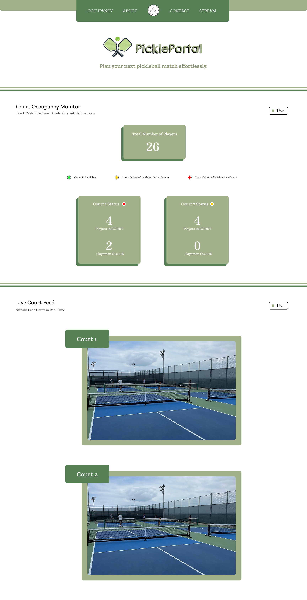

# PicklePortal

**Sensor-Based Court Availability Tracker**

A real-time IoT system for monitoring pickleball court occupancy and managing player queues using computer vision, cloud integration, and low-cost hardware.



---

## Table of Contents

- [Overview](#overview)
- [Features](#features)
- [System Architecture](#system-architecture)
- [Technology Stack](#technology-stack)
- [Hardware Components](#hardware-components)
- [Getting Started](#getting-started)
- [Project Structure](#project-structure)
- [How It Works](#how-it-works)
- [Privacy & Security](#privacy--security)
- [Team](#team)
- [License](#license)

---

## Overview

PicklePortal addresses the growing challenge of managing pickleball court availability as the sport's popularity surges. Traditional methods rely on manual sign-in sheets or informal communication, leading to inefficient scheduling and wasted time. 

Our solution combines:
- **Computer Vision** (YOLOv5) for real-time player detection
- **IoT Sensors** (ESP32-CAM, photoresistors) for occupancy and queue monitoring
- **Cloud Infrastructure** (Firebase) for data synchronization
- **Web Dashboard** (React + TypeScript) for live visibility

By integrating these technologies, PicklePortal provides an affordable, scalable, and privacy-conscious system that enhances community resource utilization and improves player experience.

---

## Features

### For Players
- **Live Camera Feeds** - View real-time video streams of each court
- **Real-Time Occupancy** - See current player counts on all courts
- **Queue Management** - Join queues by placing paddles on sensors
- **Web Dashboard** - Check court availability remotely before arrival
- **On-Site LED Indicators**:
  - 🟢 Green: Court available
  - 🟡 Yellow: Court occupied, no queue
  - 🔴 Red: Court occupied with active queue
- **LCD Displays** - On-court screens showing player and queue counts

### For Administrators
- **Usage Analytics** - Track court utilization patterns
- **Centralized Management** - Monitor all courts from a single dashboard
- **Real-Time Synchronization** - Instant updates across all devices
- **Scalable Deployment** - Easy expansion to multiple facilities

---

## System Architecture

PicklePortal operates as a **Level 4 IoT system**, combining edge-level sensing with cloud-based processing:

```
┌─────────────────────────────────────────────────────────┐
│                     Cloud Layer                         │
│  ┌──────────────┐         ┌──────────────┐            │
│  │   Firebase   │◄───────►│    Render    │            │
│  │   Realtime   │         │   (Backend)  │            │
│  │   Database   │         │   Node.js    │            │
│  └──────────────┘         └──────────────┘            │
│         ▲                        ▲                      │
└─────────┼────────────────────────┼──────────────────────┘
          │                        │
          │      Wi-Fi/HTTPS       │
          │                        │
┌─────────┼────────────────────────┼──────────────────────┐
│         ▼                        ▼                      │
│                    Edge Layer                           │
│  ┌──────────────┐  ┌──────────────┐  ┌──────────────┐ │
│  │  ESP32-CAM   │  │ Photoresistor│  │  LED + LCD   │ │
│  │  (YOLOv5)    │  │   Sensors    │  │   Displays   │ │
│  └──────────────┘  └──────────────┘  └──────────────┘ │
└─────────────────────────────────────────────────────────┘
          │                        │
          ▼                        ▼
     Court Video            Paddle Detection
```

### Key Components

1. **Hardware Layer** (Per Court)
   - ESP32-CAM module for live video streaming
   - Photoresistor sensors (3 per court) for paddle/queue detection
   - LED indicator for status visualization
   - LCD display for queue information

2. **Backend Services**
   - Node.js + Express server (hosted on Render)
   - YOLOv5 object detection for player counting
   - Firebase Realtime Database for synchronization
   - WebSocket for real-time communication

3. **Frontend Application**
   - React + TypeScript dashboard (hosted on Vercel)
   - Live video feeds from all courts
   - Real-time occupancy and queue statistics
   - Responsive design for mobile and desktop

---

## Technology Stack

### Frontend
- **Framework**: React 18
- **Language**: TypeScript
- **Build Tool**: Vite
- **Styling**: CSS3
- **Deployment**: Vercel

### Backend
- **Runtime**: Node.js
- **Framework**: Express.js
- **Database**: Firebase Realtime Database
- **Computer Vision**: YOLOv5 (Python)
- **Deployment**: Render

### Hardware
- **Microcontroller**: ESP32-CAM
- **Sensors**: Photoresistors
- **Output**: RGB LEDs, LCD I2C Display
- **Connectivity**: Wi-Fi (802.11 b/g/n)

### DevOps
- **Version Control**: Git
- **CI/CD**: GitHub Actions
- **Hosting**: Vercel (frontend), Render (backend)

---

## Hardware Components

### Bill of Materials (Per Court)

| Component | Quantity | Purpose |
|-----------|----------|---------|
| ESP32-CAM | 1 | Video streaming & processing |
| Photoresistor | 3 | Paddle detection for queue |
| RGB LED | 1 | Court status indicator |
| LCD I2C Display (16x2) | 1 | Queue information display |
| Resistors | As needed | Circuit protection |
| Breadboard/PCB | 1 | Component integration |
| Power Supply (5V) | 1 | Device power |
| Mounting Hardware | 1 set | Physical installation |

### Wiring Diagram

Each court's components are wired to the ESP32 as follows:
- **Camera Module**: Built into ESP32-CAM
- **Photoresistors**: Analog input pins (GPIO 34, 35, 36)
- **LED (RGB)**: Digital pins with PWM (GPIO 12, 13, 14)
- **LCD Display**: I2C interface (SDA: GPIO 21, SCL: GPIO 22)

---

## Getting Started

### Prerequisites

- Node.js 18+ and npm/yarn
- Git
- Firebase account and project
- ESP32 development environment (Arduino IDE or PlatformIO)

### Installation

1. **Clone the repository**
   ```bash
   git clone https://github.com/RJ-Tabelon/PicklePortal.git
   cd PicklePortal
   ```

2. **Install frontend dependencies**
   ```bash
   cd client
   npm install
   ```

3. **Install backend dependencies**
   ```bash
   cd ../server
   npm install
   ```

4. **Configure environment variables**
   
   Create `.env` files in both `client/` and `server/` directories:
   
   **server/.env**:
   ```env
   FIREBASE_API_KEY=your_firebase_api_key
   FIREBASE_AUTH_DOMAIN=your_project.firebaseapp.com
   FIREBASE_DATABASE_URL=https://your_project.firebaseio.com
   FIREBASE_PROJECT_ID=your_project_id
   PORT=3000
   ```
   
   **client/.env**:
   ```env
   VITE_FIREBASE_API_KEY=your_firebase_api_key
   VITE_FIREBASE_AUTH_DOMAIN=your_project.firebaseapp.com
   VITE_FIREBASE_DATABASE_URL=https://your_project.firebaseio.com
   VITE_FIREBASE_PROJECT_ID=your_project_id
   VITE_API_URL=http://localhost:3000
   ```

5. **Run the development servers**
   
   **Frontend**:
   ```bash
   cd client
   npm run dev
   ```
   
   **Backend**:
   ```bash
   cd server
   npm run dev
   ```

6. **Flash ESP32 devices**
   - Open the ESP32 firmware in Arduino IDE or PlatformIO
   - Configure Wi-Fi credentials and Firebase endpoints
   - Upload to each ESP32-CAM module

---

## Project Structure

```
PicklePortal/
├── client/                  # Frontend application
│   ├── src/
│   │   ├── components/      # React components
│   │   ├── hooks/          # Custom React hooks
│   │   ├── services/       # API and Firebase services
│   │   ├── types/          # TypeScript type definitions
│   │   ├── App.tsx         # Main application component
│   │   └── main.tsx        # Application entry point
│   ├── public/             # Static assets
│   ├── package.json
│   └── vite.config.ts      # Vite configuration
│
├── server/                 # Backend application
│   ├── src/
│   │   ├── controllers/    # Request handlers
│   │   ├── models/         # Data models
│   │   ├── routes/         # API routes
│   │   ├── services/       # Business logic
│   │   │   └── yolo/       # YOLOv5 integration
│   │   └── index.js        # Server entry point
│   └── package.json
│
├── hardware/               # ESP32 firmware (optional)
│   ├── esp32_camera/       # Camera module code
│   └── esp32_sensors/      # Sensor module code
│
└── docs/                   # Documentation
    ├── architecture.md
    ├── api.md
    └── hardware.md
```

---

## How It Works

### 1. Player Detection (Computer Vision)
- ESP32-CAM streams live video over Wi-Fi to the backend
- Node.js server processes frames using YOLOv5 model
- Model detects and counts people on the court
- Player count determines occupancy status

### 2. Queue Management (IoT Sensors)
- Players place paddles on photoresistor sensors to join queue
- ESP32 detects changes in light intensity
- Sensor data sent to backend via WebSocket
- Queue count updated in real-time

### 3. Data Synchronization (Cloud)
- Backend updates Firebase Realtime Database
- Firebase pushes updates to:
  - Web dashboard (React app)
  - On-site LED indicators (via ESP32)
  - LCD displays (via ESP32)
- All interfaces show consistent, live data

### 4. Status Indication
- **LED Color Coding**:
  - 🟢 **Green**: Court available (0 players)
  - 🟡 **Yellow**: Court occupied, no queue (1-4 players, queue = 0)
  - 🔴 **Red**: Court occupied with queue (players > 0, queue > 0)
- **LCD Display**: Shows "Players: X | Queue: Y"
- **Web Dashboard**: Live feeds + statistics for all courts

---

## Privacy & Security

### Privacy Measures
- **No PII Storage**: Cameras detect presence only, not identities
- **Anonymous Counting**: YOLOv5 counts objects, not faces
- **Local Processing**: Video analysis happens on backend, not stored
- **Public Space**: System deployed in public recreational areas

### Security Features
- **HTTPS Encryption**: All data transmission secured
- **Firebase Authentication**: Secure database access
- **API Rate Limiting**: Protection against abuse
- **Device Authentication**: ESP32 modules use secure tokens

---

## Team

**University of Florida - Computer and Information Science and Engineering**

- **Rainier Joshua Tabelon** 
- **Joseph Guzman** 
- **Lynette Hemingway** 
- **Charles Durkin** 

---

## Performance Metrics

The system is evaluated based on:

1. **Detection Accuracy**: Camera-based counts vs. manual observations
2. **Queue Reliability**: Paddle sensor responsiveness and Firebase sync
3. **System Latency**: Time from sensor activation to display update
4. **Display Consistency**: Data synchronization across all interfaces

---

## Use Case Scenario

**Before Arrival**:
- Player checks web dashboard from home
- Sees Court 1 has 4 people playing, 2 in queue
- Court 2 is available (green status)
- Decides to head to the facility

**At the Facility**:
- Player places paddle on photoresistor sensor for Court 1
- Queue count increases from 2 to 3
- LCD shows "Players: 4 | Queue: 3"
- LED remains red (occupied with queue)
- When game ends, camera detects 0 players
- System notifies next player in queue
- LCD updates to "Players: 0 | Queue: 2"

---

## Future Enhancements

- Mobile app for iOS and Android
- Email/SMS notifications for queue position
- Reservation system integration
- Player statistics and leaderboards
- Multi-facility support
- AI-powered usage predictions